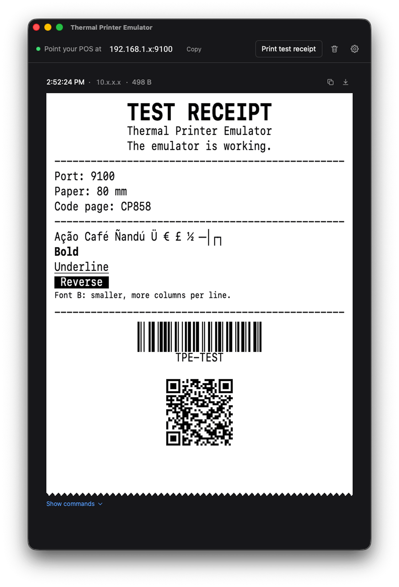

# Thermal Printer Emulator

[](https://github.com/AstrOOnauta/thermal-printer-emulator/releases/latest) [](https://github.com/AstrOOnauta/thermal-printer-emulator/actions/workflows/ci.yml) [](LICENSE) [](#installation) [](https://v2.tauri.app)

A free **ESC/POS printer emulator**: a virtual thermal receipt printer for Windows, macOS
and Linux. Point your point-of-sale software at it over the network (TCP port 9100),
print, and see the receipt on screen. Test receipt printing without a physical printer:
no paper, no hardware, no terminal.

<p align="center">
  
</p>

<p align="center">
  <a href="https://github.com/AstrOOnauta/thermal-printer-emulator/releases/latest"></a>
</p>

<p align="center">
  <b>Use it:</b> <a href="#installation">Installation</a> · <a href="#quick-start">Quick start</a> · <a href="#troubleshooting">Troubleshooting</a>
  &nbsp;|&nbsp;
  <b>Build it:</b> <a href="#run-from-source">Run from source</a> · <a href="CONTRIBUTING.md">Contributing</a>
</p>

> **Status: early development.** The emulator already receives and draws real ESC/POS
> jobs. Next: installers with a firewall rule, automatic updates and the first release.

## Features

- **Works like a network receipt printer**: listens on TCP port 9100 (configurable), for
  POS software on this computer or anywhere on your network.
- **Draws what the printer would print**: fonts A and B, bold, underline, reverse, double
  width and height, alignment, margins, tab stops, code pages (CP437, CP850, CP858,
  WPC1252 and more), raster and column images, barcodes (UPC-A, EAN-13, EAN-8, CODE39,
  ITF, CODABAR, CODE128) and QR codes, on 80 or 58 mm paper.
- **Answers status requests** (`DLE EOT`, `GS r`, `GS I`) as an online printer with paper,
  so POS software that checks before printing goes ahead.
- **One receipt per cut**, with the cash drawer kick and the beeps a job asked for, and a
  printing sound.
- **Debugging tools**: copy a receipt as text, list the ESC/POS commands that printed it,
  save its raw bytes as a `.bin` and replay them later.
- **Stays out of the way**: keeps running in the system tray, can start at login, and
  counts new receipts on its icon.
- **Updates itself**: checks for a new version once a day and installs it when you click.
- **Light or dark**, paper zoom from 75 to 200 %, keyboard shortcuts, and an interface in
  English, Spanish and Brazilian Portuguese.

## Installation

Download the installer for your system from the
[latest release](https://github.com/AstrOOnauta/thermal-printer-emulator/releases/latest):

| System                | File                                                             |
| --------------------- | ---------------------------------------------------------------- |
| Windows 10/11         | `*_x64-setup.exe`                                                |
| macOS 11+ (Intel/ARM) | `*_universal.dmg`                                                |
| Linux                 | `*.deb` (Debian/Ubuntu), `*.rpm` (Fedora/openSUSE), `*.AppImage` |

The app is free and open source, and it is **not code-signed** (signing certificates are
paid), so your system asks for confirmation the first time you open it:

<details>
<summary><b>macOS</b></summary>

1. Drag the app from the disk image to **Applications** (run from the disk image, "Launch
   at login" would break once it is ejected).
2. Open the app once and close the warning.
3. Go to **System Settings → Privacy & Security**, scroll down and click **Open Anyway**.
   On macOS 14 and older, right-click the app and choose **Open** instead.

</details>

<details>
<summary><b>Windows</b></summary>

1. On the "Windows protected your PC" screen, click **More info → Run anyway**.
2. Allow the installer to make changes. It installs the app for all users and lets it
   through the Windows firewall on **private networks**, so other devices can print to
   the emulator. Public networks stay closed.

</details>

<details>
<summary><b>Linux</b></summary>

- Open the `.deb` or `.rpm` with your software center.
- For the AppImage, mark the file as executable (Properties → Permissions) before
  opening it. It needs `libfuse2` (`libfuse2t64` on Ubuntu 24.04 and later).
- On GNOME, the tray icon needs the
  [AppIndicator extension](https://extensions.gnome.org/extension/615/appindicator-support/).

</details>

### Run from source

To run it without installing, with [Node.js](https://nodejs.org) 24+, [Rust](https://rustup.rs)
and the [Tauri prerequisites](https://v2.tauri.app/start/prerequisites/) for your system:

```bash
git clone https://github.com/AstrOOnauta/thermal-printer-emulator.git
cd thermal-printer-emulator
corepack enable && yarn install
yarn tauri dev
```

[CONTRIBUTING.md](CONTRIBUTING.md) has the details, and how to build the installers.

## Quick start

1. **Open the emulator.** The window shows the address to print to, such as
   `192.168.1.20:9100`.
2. **Add a network printer in your POS software** (TCP/IP, "RAW" or "Socket"):
   `127.0.0.1:9100` when the POS runs on the same computer, or the address in the window
   from another device on the same network.
3. **Print.** The receipt appears in the window. A cut (`GS V`) ends one receipt and
   starts the next; so does closing the connection.

**Print test receipt** checks that the emulator works on this computer. It does not test
the network: for that, print from the other device.

A job must start with an ESC/POS command (`ESC @`, which initializes the printer, is the
usual one). Other traffic on the port, such as port scanners or plain text, is ignored.

### Print a test receipt from a terminal

macOS and Linux:

```bash
printf '\x1b@Hello, printer!\n\x1dV\x00' | nc 127.0.0.1 9100
```

On Linux, add `-N` to `nc` so it closes the connection when the input ends.

Windows (PowerShell):

```powershell
$printer = New-Object Net.Sockets.TcpClient('127.0.0.1', 9100)
$bytes = [byte[]]((0x1b, 0x40) + [Text.Encoding]::ASCII.GetBytes("Hello, printer!`n") + (0x1d, 0x56, 0x00))
$printer.GetStream().Write($bytes, 0, $bytes.Length)
$printer.Close()
```

### Print a test receipt from Python

With [python-escpos](https://github.com/python-escpos/python-escpos):

```python
from escpos.printer import Network

printer = Network("127.0.0.1", port=9100)
printer.hw("INIT")  # ESC @: start from the printer's defaults
printer.set(align="center", bold=True)
printer.text("Hello from python-escpos\n")
printer.qr("https://github.com/AstrOOnauta/thermal-printer-emulator")
printer.cut()
printer.close()
```

Any ESC/POS library that prints to a network printer works the same way: point it at
`127.0.0.1:9100`, or at the address in the window.

## FAQ

**Is it free?** Yes, free and open source under the MIT license.

**Does it emulate USB or serial printers?** No. It is a network printer (TCP), the way
most POS software talks to receipt printers. Point the POS at it as a network printer.

**Does it understand ZPL, StarPRNT or PDF?** No, only ESC/POS, the command language of
Epson and most thermal receipt printers. Other data is ignored.

**Are receipts saved?** They live in memory only: the newest 100, within 32 MB, and are
gone when the app quits. Save a receipt's `.bin` to keep it.

**What are the limits?** Up to 16 MB per receipt and 16 connections at once. A connection
that sends nothing for 5 minutes is closed.

**How does it update?** Once a day it checks GitHub for a new version. When there is one,
a banner shows at the top of the window (and an item in the tray menu): click **Restart
and update** to install it. Updates are signed, and the app checks the signature before
installing. With a `.deb` or `.rpm`, the button opens the download page instead, since
your package manager owns the app; the AppImage updates itself.

**Is it safe to leave running?** It only accepts ESC/POS print jobs, never runs or saves
what it receives, and keeps nothing on disk but its settings and logs (which never hold
receipt content). To keep it off the network,
pick "only this computer" in **Settings**. See [SECURITY.md](SECURITY.md).

## Troubleshooting

<details>
<summary><b>Other devices can't print</b></summary>

- In **Settings**, check that the emulator listens on the **network**, not "only this
  computer".
- Both devices must be on the same network, and the POS must use the address shown in
  the window.
- **Windows**: the installer allows the app on private networks only. If your network
  is set to **Public**, switch it to **Private** (Settings → Network & internet → your
  network → Network profile type).
- **macOS**: if asked to allow incoming connections, choose **Allow**.

</details>

<details>
<summary><b>"Port 9100 is in use"</b></summary>

Another program holds the port: another emulator, a print server or a container. Close
it and the emulator starts on its own, or pick another port in **Settings** and point the
POS at it.

</details>

<details>
<summary><b>A receipt stays "Printing…"</b></summary>

The POS has not cut the paper or closed the connection yet. The receipt ends at the next
cut, when the connection closes, or after 5 minutes without data.

</details>

<details>
<summary><b>Characters print as <code>?</code></b></summary>

The code page in use lacks them. The POS selects one with `ESC t`; until it does, the
default code page in **Settings** applies.

</details>

<details>
<summary><b>Where are the logs and settings?</b></summary>

Open the logs from the tray (**Show logs**). They never contain what was printed, only
sizes and ids.

| System  | Logs                                                                | Settings                                                                      |
| ------- | ------------------------------------------------------------------- | ----------------------------------------------------------------------------- |
| macOS   | `~/Library/Logs/io.github.astroonauta.thermalprinteremulator/`      | `~/Library/Application Support/io.github.astroonauta.thermalprinteremulator/` |
| Windows | `%LOCALAPPDATA%\io.github.astroonauta.thermalprinteremulator\logs\` | `%APPDATA%\io.github.astroonauta.thermalprinteremulator\`                     |
| Linux   | `~/.local/share/io.github.astroonauta.thermalprinteremulator/logs/` | `~/.config/io.github.astroonauta.thermalprinteremulator/`                     |

</details>

<details>
<summary><b>How do I quit?</b></summary>

Closing the window keeps the emulator running in the tray. Quit from the tray menu, with
Ctrl+Q on Windows and Linux, or from the Dock on macOS.

</details>

Something else? [Open an issue](https://github.com/AstrOOnauta/thermal-printer-emulator/issues/new/choose):
the bug report asks for the log and the receipt's `.bin`, which usually tell the whole
story.

## Contributing

Bug reports, ideas and pull requests are welcome. [CONTRIBUTING.md](CONTRIBUTING.md) has
everything to build and run the project: prerequisites, scripts, architecture and
conventions.

## License

[MIT](LICENSE) · Made by [AstrOOnauta](https://github.com/AstrOOnauta)

<div align="center">
	<br>
	  Thanks for stopping by! 😁
	<br>
</div>
